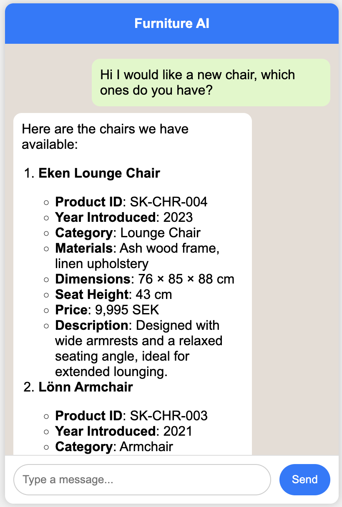
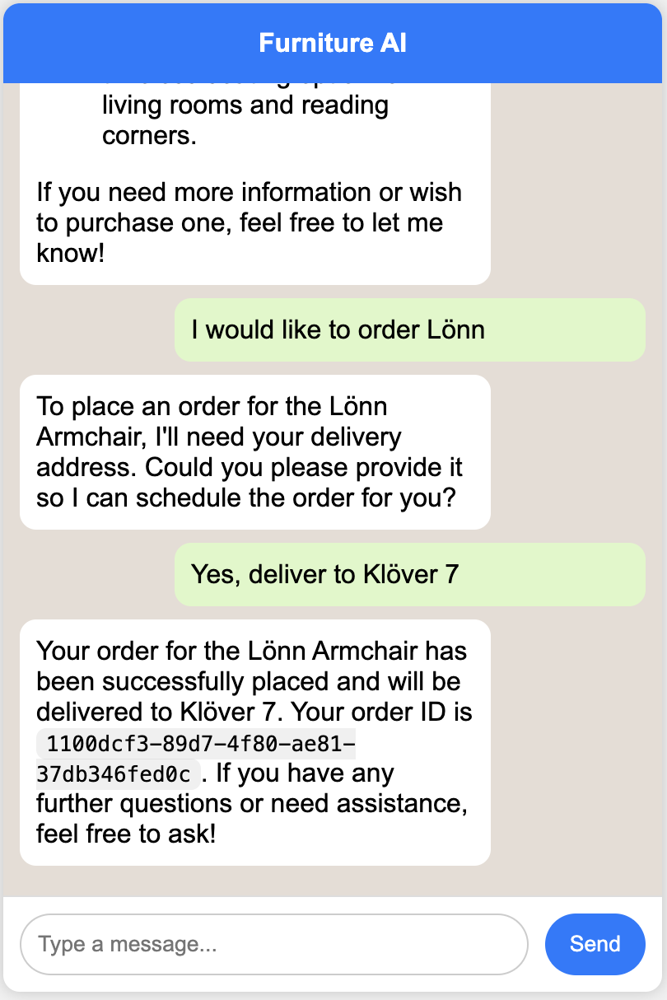
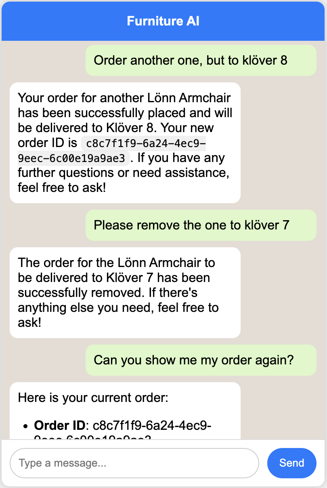
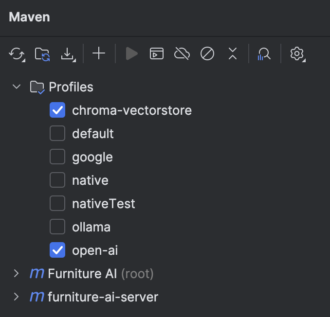

# Furniture AI (Spring AI Demo)
Furniture AI is a POC Agent that utilizes RAG connected to vectorbase containing furniture data.
The agent can answer questions about the data, place orders, remove orders and list current orders.
More advanced models (GPT o4) can calculate the total cost of your orders and more.

  
  
  
  

## Table of Contents

- [Furniture AI (Spring AI Demo)](#furniture-ai-spring-ai-demo)
    - [Prerequsites](#prerequsites)
    - [Configure LLM](#configure-llm)
        - [Configure Open AI (Recommended)](#configure-open-ai-recommended)
        - [Configure Google Gemini](#configure-google-gemini)
        - [Configure Ollama](#configure-ollama)
    - [Configure Vectorstore](#configure-vectorstore)
    - [Configure Data Ingestion (Only needed when you have an empty vectorstore)](#configure-data-ingestion-only-needed-when-you-have-an-empty-vectorstore)
    - [How to run application](#how-to-run-application)
    - [Swagger API](#swagger-api)

## Prerequsites
- Java 21 
- IntelliJ (Deploy POM & Assembly scripts it not implemented yet)
- Maven 3.9 or later
- Docker for Vector database
- A LLM Key if you use Open AI or Google, not required for Ollama. Application has been tested for Open AI
- Node & NPM for frontend

## Configure LLM
Decide if you want to use Open AI, Google or Ollama. Do only configure 1 of them

### Configure Open AI (Recommended)
Open ollama.properties
- Set the api key: `spring.ai.openai.api-key`
- (Optional) You can switch model or configure temperature
- Complete parameter set can be found here: https://docs.spring.io/spring-ai/reference/api/chat/openai-chat.html

### Configure Google Gemini
Open google.properties
- Set api key: `spring.ai.google.genai.chat.api-key`
- (Optional) You can switch model or configure temperature
- Complete parameter set can be found here: https://docs.spring.io/spring-ai/reference/api/chat/google-genai-chat.html

### Configure Ollama
Host ollama on a server with access to GPU, then open ollama.properties
- Set url to ollama `spring.ai.ollama.base-url`
- Configure model `spring.ai.ollama.chat.options.model`
- Complete parameter set can be found here: https://docs.spring.io/spring-ai/reference/api/chat/ollama-chat.html

## Configure Vectorstore
Currently, only chroma vectorstore is supported
- Run the following command in a terminal: `docker run -it --name chroma -p 8000:8000 ghcr.io/chroma-core/chroma:1.0.0`

## Configure Data Ingestion (Only needed when you have an empty vectorstore)
Open common.properties
- Schedule an data ingestion with `etl.ingest.cron.time`. A cron expression is expected, for example `0 50 18 * * *` will start a ingestion at 18:50 every day.
- This will ingest the file `products.md` to the chroma vectorstore

## How to run application
- (Not required right now) Build project with `mvn clean install -Popen-ai,chroma-vectorstore` (open-ai can be switched to ollama or google)
- Open IntelliJ, select the profiles `chroma-vectorstore` and the profile for the model provider you want to use and have configured  

- Launch application, the chroma vectorstore needs to running in the background for the application to start.
- Wait for data ingestion (the time you scheduled), `ETL Finished` will be logged when the ingestion is finished.
- Start the frontend by open a terminal in the `chat-frontend` directory and run npm start

## Swagger API
- API can be viewed and tested, swagger requires the application to be running.
- URL: http://localhost:8080/swagger